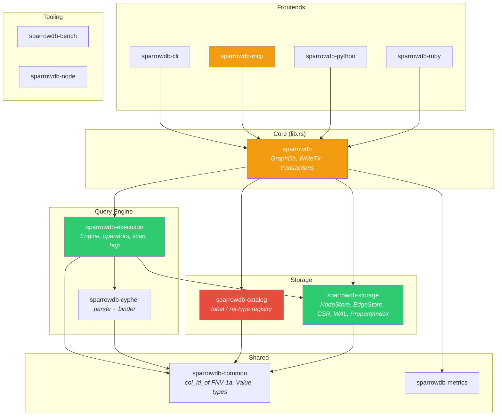
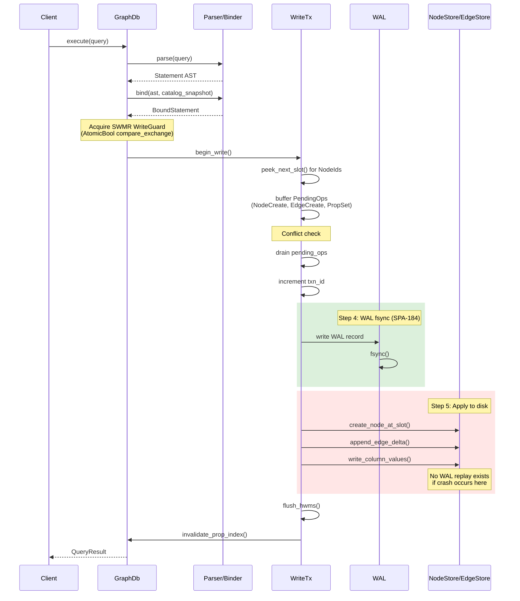

# SparrowDB Architecture Deep Audit

_Generated 2026-03-27. Validated against source with file:line references._

---

## 1. Crate Dependency Diagram

**Legend:** Red = correctness risk. Amber = tech debt accumulator. Green = solid.

---

## 2. Write-Path Flow Diagram

---

## 3. What's Right

### 3.1 SWMR Lock Design
`WriteGuard` uses `AtomicBool` with `compare_exchange` and RAII `Drop`. No `unsafe`, no mutex deadlock risk. Returns `WriterBusy` instantly rather than blocking.
> `crates/sparrowdb/src/lib.rs` WriteGuard impl

### 3.2 WAL-First Commit Ordering (SPA-184)
The commit sequence is correct: conflict check -> drain staged updates -> increment txn_id -> write+fsync WAL -> apply to disk. If the process crashes after fsync but before disk writes, the WAL has the intent. This is textbook WAL design.
> `crates/sparrowdb/src/lib.rs:~3313` WriteTx::commit()

### 3.3 `execute_batch` Single-Fsync
Batching N creates into one `WriteTx` with one fsync is the right primitive for bulk ingestion. The `iter_with_setup` pattern in benchmarks correctly isolates string formatting from measurement.
> `crates/sparrowdb/src/lib.rs:1817-1900`
> `crates/sparrowdb/benches/batch_benchmarks.rs`

### 3.4 FNV-1a `col_id_of` Centralized
One canonical hash function in `sparrowdb_common`, used everywhere. No drift between write path and read path. Eliminates the risk of two code paths computing different col_ids for the same property name.
> `crates/sparrowdb-common/src/lib.rs`

### 3.5 VersionStore Snapshot Isolation
Before-image insertion at `prev_txn_id`, new value at `new_txn_id`, binary search via `partition_point` -- correct MVCC implementation for the single-writer model.
> `crates/sparrowdb/src/lib.rs:101-149`

### 3.6 Benchmark Suite
Fixtures built outside `b.iter()`, ring graph for deterministic traversal, `criterion::black_box` to prevent optimization elision. `bench_100_individual_creates` vs `bench_100_batch_creates` cleanly isolates fsync cost.
> `crates/sparrowdb/benches/graph_benchmarks.rs`
> `crates/sparrowdb/benches/batch_benchmarks.rs`

### 3.7 Cypher Injection Prevention in MCP
`validate_cypher_identifier` uses allowlist `[A-Za-z_][A-Za-z0-9_]*`. `escape_cypher_string` handles backslash and single-quote escaping. Critical for an MCP server that builds Cypher from user input.
> `crates/sparrowdb-mcp/src/main.rs:468-489`

---

## 4. What's Wrong

### 4.1 Correctness Risks (Red)

#### 4.1.1 Catalog mutations are not transactional
When a `WriteTx` calls `create_label` or `get_or_create_rel_type_id`, those writes go to disk immediately -- not buffered in `pending_ops`. If the transaction is dropped without committing (because a subsequent operation fails), the label exists in the catalog permanently but no nodes of that label exist. A partial import that crashes mid-way leaves ghost labels in the catalog forever.
> `crates/sparrowdb/src/lib.rs` -- catalog write methods

#### 4.1.2 VersionStore has no garbage collection
Every `SET` on any property appends a `Version` entry to `HashMap<(NodeId.0, col_id), Vec<Version>>`. The version chain for a frequently-updated key grows without bound. There is no eviction once all readers pinned before a given txn_id have dropped. On a long-running process with frequent property updates, this is a memory leak.
> `crates/sparrowdb/src/lib.rs:101-149` -- VersionStore

#### 4.1.3 `delete_node` skips CSR edge check
The delete check iterates rel_table delta logs and checks for the node ID. But edges that have been checkpointed into the CSR are not checked. A node that has all its edges flushed into the CSR can be deleted without `NodeHasEdges` ever firing, silently creating dangling edge references.
> `crates/sparrowdb/src/lib.rs:3040-3076` -- only delta log iterated, no CSR scan

#### 4.1.4 Unique constraints are in-memory only
`unique_constraints: RwLock<HashSet<(u32, u32)>>` is lost on process restart. `CREATE CONSTRAINT` issued in one session is silently ignored the next time the process starts. Any user relying on constraints for data integrity is unknowingly relying on nothing after a restart.
> `crates/sparrowdb/src/lib.rs:297, 934-961`

#### 4.1.5 WAL is write-only (no replay)
WAL records are written and fsynced (SPA-184), but `GraphDb::open` never reads or replays the WAL. A crash between WAL fsync (Step 4) and disk write (Step 5) in `commit()` leaves the database in a state where the WAL says something happened but data files don't reflect it, and nothing replays it on next open. The WAL provides the appearance of durability without the substance.
> `crates/sparrowdb/src/lib.rs` -- GraphDb::open, no WAL replay code

#### 4.1.6 `execute_batch` intra-batch visibility gap
The code takes a `catalog_snap` at the start of `execute_batch` and binds all statements against it. But `execute_batch_mutation` for `Merge` or `MatchMutate` re-reads the catalog inside the loop. More critically: MATCH...MERGE in a batch reads committed on-disk state only; nodes/edges created earlier in the same batch are not visible to the MERGE existence check. Two statements in the same batch can produce duplicates.
> `crates/sparrowdb/src/lib.rs:1817-1900` -- catalog_snap at line 1827, fresh snapshot at 1872

#### 4.1.7 `n_nodes` calculation overcounts for multi-label graphs
The code sums HWMs across all labels. But the CSR is indexed by slot per label. If you have 500 Person nodes (slots 0..499) and 500 Company nodes (slots 0..499), the sum is 1000 but each label's slot space is only 0..499. Passing `n_nodes=1000` to the CSR builder for a label that only has 500 slots either wastes memory or produces incorrect degree arrays.
> `crates/sparrowdb/src/lib.rs:2174-2212` -- db_counts HWM sum
> `crates/sparrowdb-storage/src/maintenance.rs:84-118` -- n_nodes passed to checkpoint/optimize

---

### 4.2 Tech Debt and Operational Risk (Amber)

#### 4.2.1 MCP binary builds its own Cypher strings
`build_create_query`, `build_add_property_query`, `build_count_query` are custom string builders that produce Cypher. They don't go through the parser, binder, or any AST validation. This is a second code path parallel to the actual Cypher engine. If the engine's behavior changes, the MCP binary silently diverges. It can also produce Cypher strings the engine can't parse, with errors surfacing only at runtime.
> `crates/sparrowdb-mcp/src/main.rs:503-572`

#### 4.2.2 `invalidate_prop_index` called twice per mutation
`commit()` calls `self.inner.invalidate_prop_index()`. Then every `execute_*` method also calls `self.invalidate_prop_index()` after commit. The extra clear is harmless (bumps a generation counter) but indicates cache invalidation is not owned in one place.
> `crates/sparrowdb/src/lib.rs:~3485` (commit) and each execute_* method

#### 4.2.3 `execute_with_timeout` silently drops timeout for mutations
The method signature accepts a `Duration`, but mutations are forwarded to the existing write-transaction code path without a timeout. A slow `MATCH...SET` matching 100K nodes runs forever despite the caller passing `Duration::from_secs(5)`. No documentation at the call site warns the caller.
> `crates/sparrowdb/src/lib.rs:864-924` -- lines 892-901 bypass timeout for mutations

#### 4.2.4 `db_counts()` edge fallback to `RelTableId(0)`
If no rel tables exist in the catalog, the code falls back to scanning table id=0. If the catalog is empty because it was freshly opened but edges exist from a prior session written to table-0 before the catalog was created, this can produce wrong counts. The fallback hides a genuine inconsistency.
> `crates/sparrowdb/src/lib.rs:2190-2195`

#### 4.2.5 `_sparrow_export_id` left on all imported nodes
Every imported graph is permanently polluted with an extra property on every node. `REMOVE` doesn't exist yet. Affects query results, schema introspection, and storage size with no current mitigation.
> `crates/sparrowdb/src/export.rs:296-311` -- injected at line 304

#### 4.2.6 `export_dot` O(E) memory deduplication
Both `export_dot` and `export` iterate the full delta log and CSR independently, deduplicating with a `HashSet<(u64, u64, String)>`. On a 500K-edge graph this allocates a 500K-entry HashSet in memory before writing a single byte. No streaming export path exists.
> `crates/sparrowdb/src/export.rs:198` -- HashSet dedup

#### 4.2.7 `gen-fixtures.rs` uses `SmallRng`
`rand::rngs::SmallRng` is explicitly documented as not cryptographically secure and subject to algorithm change between rand versions. Fixture outputs are not pinned to a specific rand version. If rand bumps SmallRng's algorithm, all fixtures silently change and tests break.
> `crates/sparrowdb/src/bin/gen-fixtures.rs:326-369`

---

## 5. Remediation Roadmap

### P0 -- Data Integrity (fix before any production use)

| Issue | Fix | Effort |
|-------|-----|--------|
| **WAL has no replay** (4.1.5) | Implement WAL replay in `GraphDb::open`. Scan WAL, compare txn_ids with on-disk state, replay missing ops. | Medium |
| **`delete_node` skips CSR** (4.1.3) | Add CSR neighbor scan in delete_node for each rel_table. Check both fwd and bwd CSR files. | Small |
| **Catalog mutations not transactional** (4.1.1) | Buffer catalog mutations in `pending_ops` and apply them in `commit()` alongside node/edge writes. Roll back on drop. | Medium |
| **Unique constraints not persisted** (4.1.4) | Serialize constraints to a `constraints.bin` file during `register_unique_constraint`. Load on `GraphDb::open`. | Small |

### P1 -- Correctness at Scale (fix before sustained workloads)

| Issue | Fix | Effort |
|-------|-----|--------|
| **VersionStore no GC** (4.1.2) | Track minimum active snapshot txn_id. Periodically prune versions older than that watermark. | Medium |
| **`execute_batch` visibility gap** (4.1.6) | Make intra-batch writes visible to subsequent MERGE existence checks by consulting `pending_ops` during the scan. | Medium |
| **`n_nodes` overcounting** (4.1.7) | Pass per-label HWM to CSR builder, not the sum across all labels. | Small |
| **`execute_with_timeout` ignores mutations** (4.2.3) | Thread deadline into mutation code path, check in hot loops (e.g., MATCH scan before SET). | Small |

### P2 -- Tech Debt (address opportunistically)

| Issue | Fix | Effort |
|-------|-----|--------|
| **MCP builds own Cypher** (4.2.1) | Have MCP call `GraphDb::execute` directly instead of building query strings. | Medium |
| **Double `invalidate_prop_index`** (4.2.2) | Remove the call from `commit()` or from `execute_*`, not both. | Trivial |
| **`_sparrow_export_id` pollution** (4.2.5) | Implement `REMOVE` clause or add a post-import cleanup pass. | Small |
| **`export_dot` O(E) memory** (4.2.6) | Stream edges directly to writer with an on-the-fly dedup bloom filter or sorted merge. | Small |
| **`db_counts()` fallback** (4.2.4) | Remove the fallback; return (0, 0) when catalog is empty. | Trivial |
| **`gen-fixtures.rs` SmallRng** (4.2.7) | Pin to `ChaCha8Rng` or commit fixture outputs as golden files. | Trivial |

---

## 6. Summary Judgment

The transaction model and write path are thoughtfully designed and mostly correct for a single-writer embedded database. The real exposure is three things:

1. **Catalog mutations not being transactional** -- silent corruption on failed imports
2. **WAL existing without replay** -- durability theater
3. **Unique constraints not persisting** -- correctness guarantee that evaporates on restart

The MCP binary building its own query strings is the biggest ongoing tech debt accumulator -- every new feature in the engine needs to be manually mirrored there or it silently diverges.

The `delete_node` CSR gap is the most likely to cause user-visible data corruption in normal operation, since any graph that has been checkpointed (which happens automatically) will have edges invisible to the delete safety check.
